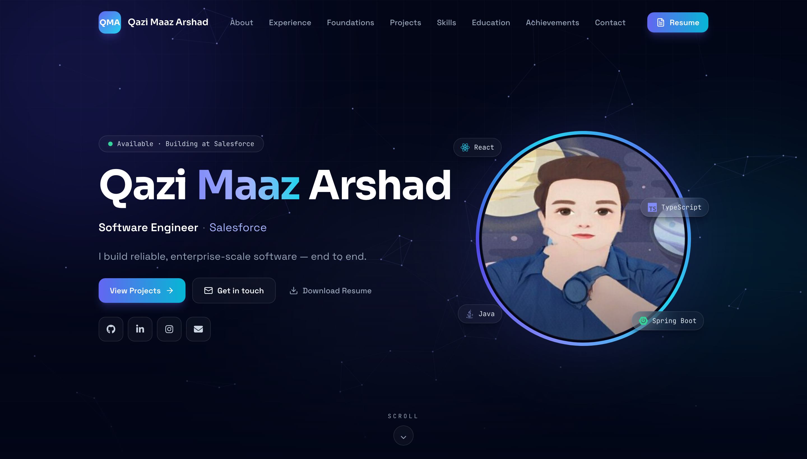

<div align="center">

# Qazi Maaz Arshad — Portfolio

**Software Engineer @ Salesforce · Full-stack, AI-first**

[](https://qazimaazarshad.github.io/)
&nbsp;
[](https://www.linkedin.com/in/qazimaazarshad/)


<br/>

<a href="https://qazimaazarshad.github.io/">
  
</a>

</div>

---

A modern, interactive personal portfolio — designed and built from the ground up as a
typed, component-driven single-page app, then hardened with a full unit / e2e / visual /
responsiveness test suite.

**Live:** https://qazimaazarshad.github.io/

## ✨ Highlights

- **🤖 In-browser AI assistant** — "Ask my portfolio" runs a real LLM **100% client-side** (WebLLM + WebGPU), grounded on my content — no backend, no API keys, private to the visitor
- **⌘K command palette** — Spotlight-style launcher to jump to any section, open projects, copy email, or download the résumé (keyboard-driven)
- **Animated canvas** particle constellation + aurora backdrop that reacts to the cursor
- **Interactive projects gallery** — searchable, category-filterable, with detail modals (focus-trapped & accessible)
- **Scroll-reveal** animations, scroll progress bar, active-section nav tracking, 3D tilt cards, glassmorphism UI
- **Fancy preloader**, custom QMA favicon, and a polished dark theme (violet → cyan)
- **Fully responsive** (verified across 7 viewports) and **accessible** — keyboard-navigable, `prefers-reduced-motion` aware
- **100% data-driven** — all content lives in one typed source (`src/data/content.ts`)

## 🛠 Tech stack

| Area      | Tools                                                                         |
| --------- | ----------------------------------------------------------------------------- |
| Framework | **React 19** + **TypeScript** (strict)                                        |
| Build     | **Vite**                                                                      |
| Styling   | **Tailwind CSS** (custom design tokens)                                       |
| Animation | **Framer Motion**                                                             |
| AI        | **WebLLM** — in-browser LLM (WebGPU) powering the "Ask my portfolio" chat     |
| Icons     | lucide-react + react-icons                                                    |
| Testing   | **Vitest** + React Testing Library · **Playwright** (e2e, visual, responsive) |
| CI/CD     | **GitHub Actions** — verify on push/PR, auto-deploy to Pages on `main`        |

## 🚀 Getting started

```bash
npm install
npm run dev        # start the Vite dev server
npm run build      # type-check + production build → dist/
npm run preview    # preview the production build
```

## 🧪 Testing

```bash
npm test                 # unit + component tests (Vitest)
npm run test:coverage    # unit tests with coverage
npm run test:e2e         # e2e, visual & responsiveness tests (Playwright)
npm run test:e2e:update  # regenerate visual baselines
```

## 📁 Structure

```
src/
  data/content.ts     # single source of truth for all content (typed)
  lib/                # utils (cn, asset), motion variants, aiContext (AI grounding)
  hooks/              # useActiveSection
  components/
    ui/               # Section, SectionHeading, Reveal, TiltCard, SocialLinks
    effects/          # AnimatedBackground, ScrollProgress, Preloader
    command/          # CommandPalette (⌘K)
    ai/               # AiAssistant — in-browser "Ask my portfolio" chat
    …                 # hero / projects / skills / timeline / …
  sections/           # Navbar, Hero, About, Experience, EarlierExperience,
                      # Projects, Skills, Education, Achievements, Hobbies, Contact, Footer
  App.tsx             # composition root
tests/
  setup.ts            # Vitest setup (jsdom globals, jest-dom)
  unit/               # Vitest + RTL unit/component tests (mirrors src/)
  e2e/                # Playwright specs + visual baselines
public/               # images, resume, static assets
.github/workflows/    # ci.yml (verify) + deploy.yml (Pages)
```

## ✍️ Editing content

Everything — profile, experience, projects, skills, education, achievements — lives in
`src/data/content.ts`. Update the data and the UI updates automatically; no markup changes needed.

## 🔄 CI/CD

Two GitHub Actions workflows run automatically:

- **`ci.yml`** — on every push and pull request: type-check + build, unit tests
  (Vitest), and the Playwright e2e/functional/responsive suite.
- **`deploy.yml`** — on every push to `main`: builds and deploys to **GitHub Pages**
  at [qazimaazarshad.github.io](https://qazimaazarshad.github.io/) (Pages source is
  "GitHub Actions").

## 📦 Deployment

Deployment is fully automated via `deploy.yml` — just push to `main`. To build/preview
locally:

```bash
npm run build      # → dist/
npm run preview
```

## 📫 Connect

[Portfolio](https://qazimaazarshad.github.io/) ·
[LinkedIn](https://www.linkedin.com/in/qazimaazarshad/) ·
[GitHub](https://github.com/QAZIMAAZARSHAD) ·
[LeetCode](https://leetcode.com/qazimaazarshad/)

## 📄 License

[MIT](LICENSE)
