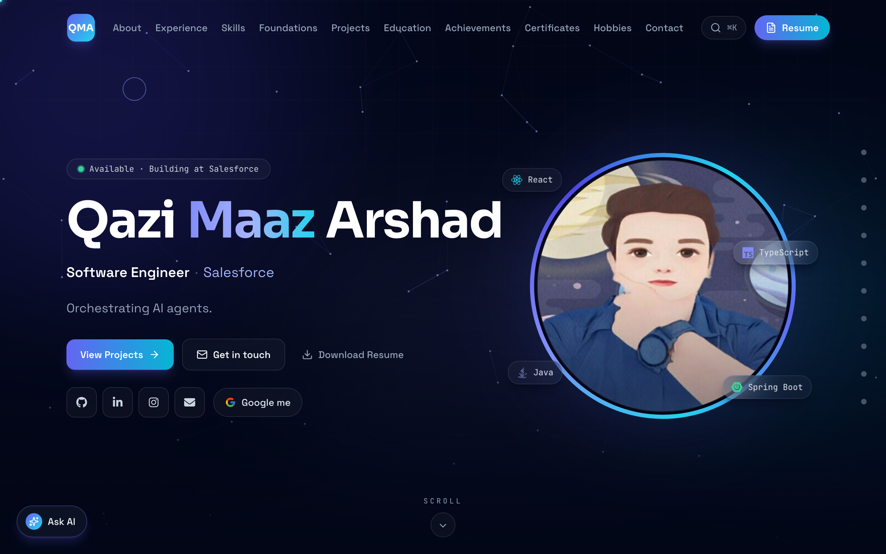

<div align="center">

# Qazi Maaz Arshad — Portfolio

**Software Engineer @ Salesforce · Full-stack, AI-first**

[](https://qazimaazarshad.github.io/)
&nbsp;
[](https://www.linkedin.com/in/qazimaazarshad/)


<br/>

<a href="https://qazimaazarshad.github.io/">
  
</a>

</div>

---

A modern, interactive personal portfolio — designed and built from the ground up as a
typed, component-driven single-page app, then hardened with a full unit / e2e / visual /
responsiveness test suite.

**Live:** https://qazimaazarshad.github.io/

## ✨ Highlights

- **🚪 Entry sequence** — a loader, then a door you open. That click is the gesture browsers require before audio, so the greeting behind it can be scored: it says hello in a dozen languages and lands on yours, read from your browser
- **🤖 In-browser AI assistant** — "Ask my portfolio" runs a real LLM 100% client-side (WebLLM + WebGPU), grounded on my content — no backend, no keys
- **Rich micro-interactions** — a custom trailing cursor, scramble-decode hero tagline, magnetic buttons, cursor spotlight on cards, scroll-drawn timeline, animated count-ups, section-heading underlines, tech marquee, side scroll-dots, cinematic hobby impacts, subtle parallax & confetti — all `prefers-reduced-motion` aware
- **📜 Certificates gallery** & **interactive projects** — filterable, searchable, with focus-trapped lightboxes/modals
- **⌘K command palette** for keyboard-driven navigation
- **🔍 "Google me"** — a mock search-results page mapping my presence across the web
- **Morphing dock navbar** that collapses into a floating dock on scroll, and a **kinetic signature footer** whose wordmark is painted by your cursor
- **Career-progression timeline** with live-computed tenure, plus a cursor-reactive animated canvas and polished dark theme
- **Fully responsive & accessible** — keyboard-navigable, `prefers-reduced-motion` aware
- **100% data-driven** and thoroughly tested (unit · e2e · visual)

## 🛠 Tech stack

| Area      | Tools                                                                         |
| --------- | ----------------------------------------------------------------------------- |
| Framework | **React 19** + **TypeScript** (strict)                                        |
| Build     | **Vite**                                                                      |
| Styling   | **Tailwind CSS** (custom design tokens)                                       |
| Animation | **Framer Motion**                                                             |
| AI        | **WebLLM** — in-browser LLM (WebGPU) powering the "Ask my portfolio" chat     |
| Counter   | **Abacus** — footer visit + love counters (no account, no backend)            |
| Icons     | lucide-react + react-icons                                                    |
| Linting   | **oxlint** — correctness, React, hooks, jsx-a11y, imports                     |
| Testing   | **Vitest** + React Testing Library · **Playwright** (e2e, visual, responsive) |
| CI/CD     | **GitHub Actions** — verify on push/PR, auto-deploy to Pages on `main`        |

## 🚀 Getting started

```bash
npm install
npm run dev        # start the Vite dev server
npm run build      # type-check + production build → dist/
npm run lint       # oxlint (warnings fail, as in CI)
npm run preview    # preview the production build
```

## 🧪 Testing

```bash
npm test                 # 188 unit + component tests (Vitest)
npm run test:coverage    # unit tests with coverage
npm run test:e2e         # 118 e2e, visual & responsiveness tests (Playwright)
npm run test:e2e:update  # regenerate visual baselines
```

Visual baselines are committed for macOS (`*-darwin.png`). Specs that aren't about
the entry sequence get past it with the shared `enterSite()` helper in
`tests/e2e/intro.ts`.

## 📁 Structure

```
src/
  data/
    content.ts        # single source of truth for all content (typed)
    certificates.ts   # AUTO-GENERATED certificate data (see scripts/)
  lib/                # utils, motion, sound, confetti, skillFilter, aiContext (AI grounding)
  hooks/              # useActiveSection (scroll spy)
  components/
    ui/               # Section, SectionHeading, Reveal, TiltCard, SocialLinks, CountUp
    effects/          # Preloader, EntryDoor, Welcome, CustomCursor, HobbyImpact,
                      # AnimatedBackground, ScrollProgress, SideNav, SpotlightEffect
    footer/           # SignatureName (cursor-painted wordmark), FooterBackdrop
    google/           # GoogleMe — mock search-results modal
    command/          # CommandPalette (⌘K)
    ai/               # AiAssistant — in-browser "Ask my portfolio" chat
    certificates/     # CertificateCard, CertificateLightbox
    analytics/        # VisitCounter (Abacus)
    …                 # hero / projects / skills / timeline / achievements / contact
  sections/           # Navbar, Hero, About, Experience, EarlierExperience, Projects,
                      # Skills, Education, Achievements, Certifications, Hobbies, Contact, Footer
  App.tsx             # composition root
scripts/
  generate-certificates.mjs  # builds certificate previews + certificates.ts
  generate-resume.mjs        # renders the downloadable resume
tests/
  setup.ts            # Vitest setup (jsdom globals, jest-dom)
  unit/               # Vitest + RTL unit/component tests (mirrors src/)
  e2e/                # Playwright specs + visual baselines
    intro.ts          # shared helper that gets specs past the entry sequence
public/               # images, audio, resume, certificates, static assets
.oxlintrc.json        # lint rules (every exception carries its reason)
.github/workflows/    # ci.yml (verify) + deploy.yml (Pages)
```

## ✍️ Editing content

Everything — profile, experience, projects, skills, education, achievements — lives in
`src/data/content.ts`. Update the data and the UI updates automatically; no markup changes needed.

**Certificates** are generated: drop files into the source folder and run
`node scripts/generate-certificates.mjs`, which renders compact previews, keeps
originals for real credentials, and rewrites `src/data/certificates.ts`.

**Counters**: set `analytics.visitCounter` / `analytics.loveCounter` in
`content.ts` to an [Abacus](https://abacus.jasoncameron.dev/docs)
`"<namespace>/<key>"` path (empty disables). Counting is skipped on `localhost`
so local and CI runs never inflate the real totals.

These ran on CounterAPI until it retired its unauthenticated v1 on 7 Aug 2026.
The v2 replacement needs a bearer token on every call, which a static site can
only ship in its own bundle, and its domain is on EasyPrivacy — so blockers were
already hiding the count from a large share of visitors. Abacus needs no account
and isn't on the list. Seed a total with
`GET /create/<namespace>/<key>?initializer=<n>`, which returns an admin key
**once**; keep it somewhere safe, as it's the only way to later reset or delete
the counter. A counter expires six months after its last access, and any live
traffic keeps pushing that out.

## 🔄 CI/CD

Two GitHub Actions workflows run automatically:

- **`ci.yml`** — on every push and pull request: format check, lint, type-check +
  build, unit tests (Vitest), and the Playwright e2e suite. Visual baselines are
  committed for macOS, so pixel comparisons are skipped on Linux CI while every
  functional test still runs.
- **`deploy.yml`** — on every push to `main`: builds and deploys to **GitHub Pages**
  at [qazimaazarshad.github.io](https://qazimaazarshad.github.io/) (Pages source is
  "GitHub Actions").

## 📦 Deployment

Deployment is fully automated via `deploy.yml` — just push to `main`. To build/preview
locally:

```bash
npm run build      # → dist/
npm run preview
```

## 📫 Connect

[Portfolio](https://qazimaazarshad.github.io/) ·
[LinkedIn](https://www.linkedin.com/in/qazimaazarshad/) ·
[GitHub](https://github.com/QAZIMAAZARSHAD) ·
[LeetCode](https://leetcode.com/qazimaazarshad/)

## 📄 License

[MIT](LICENSE)
